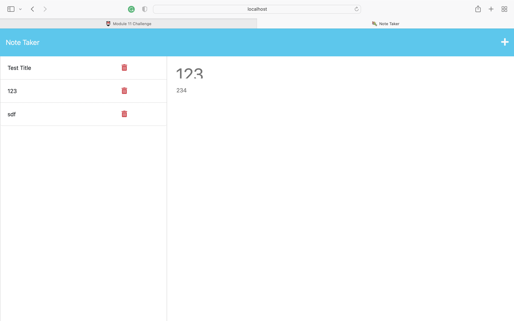

# Note Taker Starter Code

## Description

- This project is a note taking application that enables the audience to write, save and delete notes.

## Usage

- This project will use an Express.js back end and will save and retrieve note data from a JSON file. 

## Images

## deployed application

[Github link] (https://github.com/Jennyzzhh/Module-10-Object-Oriented-Programming-Challenge-Team-Profile-Generator.git)